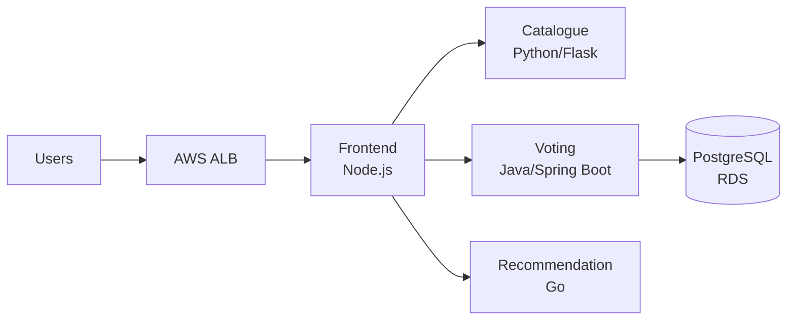

# Craftista Application - Microservices Platform

[](https://github.com/Abhin-Anilkumar/K8s-demo/actions)
[](https://kubernetes.io/)
[](https://helm.sh/)

Production-ready microservices application for the Craftista origami platform, featuring automated CI/CD, multi-environment deployment, and comprehensive monitoring.

> **Infrastructure Repository**: [EKS-project-for-8byte](https://github.com/Abhin-Anilkumar/EKS-project-for-8byte) - Terraform IaC for AWS EKS cluster

---

## 📋 Table of Contents

- [About Craftista](#about-craftista)
- [Architecture](#architecture)
- [Quick Start](#quick-start)
- [CI/CD Pipeline](#cicd-pipeline)
- [Deployment Guide](#deployment-guide)
- [Monitoring & Logging](#monitoring--logging)
- [Security](#security)
- [Documentation](#documentation)

---

## 🎨 About Craftista

**Craftista** is a web platform celebrating the art of origami, where enthusiasts showcase creations, vote for favorites, and discover daily featured origami.

### Features

- **Origami Showcase**: Browse diverse origami creations
- **Voting System**: Community-driven voting for favorite pieces
- **Daily Recommendations**: Handpicked origami masterpiece each day
- **Artist Profiles**: Learn about origami artists and their work


---

## 🏗️ Architecture

### Microservices Overview



| Service | Language | Framework | Purpose |
|---------|----------|-----------|---------|
| **Frontend** | Node.js | Express.js | Web UI and API gateway |
| **Catalogue** | Python | Flask | Product/origami catalog management |
| **Voting** | Java | Spring Boot | User voting and persistence |
| **Recommendation** | Go | Gin | Daily origami recommendations |

### Technology Stack

- **Container Runtime**: Docker (AMD64)
- **Orchestration**: Kubernetes (EKS 1.34)
- **Package Manager**: Helm 3
- **CI/CD**: GitHub Actions
- **Monitoring**: Prometheus + Grafana
- **Logging**: AWS CloudWatch
- **Database**: PostgreSQL (RDS Multi-AZ)
- **Registry**: Amazon ECR

---

## 🚀 Quick Start

### Prerequisites

- **kubectl** configured for EKS cluster
- **Helm** >= 3.0
- **AWS CLI** with ECR access

### 1. Clone the Repository

```bash
git clone https://github.com/Abhin-Anilkumar/K8s-demo.git
cd K8s-demo
```

### 2. Create Database Secret

```bash
# Production namespace
kubectl create secret generic voting-db-credentials \
  --from-literal=username=postgres \
  --from-literal=password=<RDS_PASSWORD> \
  -n app

# Staging namespace
kubectl create secret generic voting-db-credentials \
  --from-literal=username=postgres \
  --from-literal=password=<RDS_PASSWORD> \
  -n stage-app
```

### 3. Deploy Services (Production)

```bash
# Deploy all microservices
helm upgrade --install frontend ./charts/frontend -n app
helm upgrade --install catalogue ./charts/catalogue -n app
helm upgrade --install voting ./charts/voting -n app
helm upgrade --install recommendation ./charts/recommendation -n app
```

### 4. Verify Deployment

```bash
kubectl get pods -n app
kubectl get svc -n app
```

---

## 🔄 CI/CD Pipeline

### Branching Strategy

```
main (production) ──┐
                    ├─── PR ──── Build Validation
develop (staging) ──┘
```

### Pipeline Stages

| Stage | Trigger | Actions | Target |
|-------|---------|---------|--------|
| **Build Validation** | PR to `develop` | Docker build all services | - |
| **Build & Push** | Push to `develop`/`main` | Build + Push to ECR | ECR |
| **Deploy Staging** | Push to `develop` | Helm upgrade | `stage-app` namespace |
| **Deploy Production** | Push to `main` | Manual approval + Helm upgrade | `app` namespace |

### Workflow File

`.github/workflows/app-ci.yml`:

```yaml
name: Application CI/CD

on:
  pull_request:
    branches: [develop]
  push:
    branches: [develop, main]

jobs:
  validate-build:
    # Runs on PR - validates Docker builds
    
  build-and-push:
    # Builds and pushes to ECR
    
  deploy-staging:
    # Auto-deploys to stage-app namespace
    
  deploy-production:
    # Manual approval required
    environment: production
```

### Environment Variables

Set these in GitHub Secrets:
- `AWS_ACCESS_KEY_ID`
- `AWS_SECRET_ACCESS_KEY`
- `AWS_REGION` (default: us-east-1)
- `ECR_REGISTRY` (e.g., `381492170891.dkr.ecr.us-east-1.amazonaws.com`)

---

## 📦 Deployment Guide

### Helm Charts Structure

```
charts/
├── frontend/
│   ├── Chart.yaml
│   ├── values.yaml
│   └── templates/
├── catalogue/
├── voting/
└── recommendation/
```

### Configuration

Each service has a `values.yaml` for customization:

**Example** (`charts/frontend/values.yaml`):
```yaml
replicaCount: 3

image:
  repository: 381492170891.dkr.ecr.us-east-1.amazonaws.com/frontend
  tag: latest
  pullPolicy: Always

service:
  type: LoadBalancer
  port: 80

resources:
  requests:
    cpu: 100m
    memory: 128Mi
  limits:
    cpu: 200m
    memory: 256Mi
```

### Namespace Isolation

- **`app`**: Production environment
- **`stage-app`**: Staging environment
- **`monitoring`**: Prometheus + Grafana

### Scaling

**Horizontal Pod Autoscaler** (HPA):
```bash
kubectl autoscale deployment frontend --cpu-percent=70 --min=2 --max=10 -n app
```

---

## 📊 Monitoring & Logging

### Prometheus + Grafana

**Installation**:
```bash
# Add Helm repos
helm repo add prometheus-community https://prometheus-community.github.io/helm-charts
helm repo add grafana https://grafana.github.io/helm-charts
helm repo update

# Install Prometheus
helm install prometheus prometheus-community/prometheus -n monitoring --create-namespace

# Install Grafana
helm install grafana grafana/grafana -n monitoring
```

**Access Grafana**:
```bash
kubectl port-forward -n monitoring svc/grafana 3000:80

# Get admin password
kubectl get secret grafana -n monitoring -o jsonpath="{.data.admin-password}" | base64 --decode
```

### Dashboards

Import the pre-configured dashboards:
1. **Infrastructure Overview**: `grafana-dashboards/infrastructure-overview.json`
   - Node CPU, Memory, Disk usage
   - Network I/O
   - Pod count and node status

2. **Application Performance**: `grafana-dashboards/application-performance.json`
   - Pod CPU/Memory per service
   - Pod restart counts
   - Service availability
   - Network traffic

**Data Source Configuration**:
- URL: `http://prometheus-server.monitoring.svc.cluster.local`
- Access: Server (default)

### CloudWatch Logs

**View Application Logs**:
```bash
aws logs tail /aws/containerinsights/prod-eks/application --follow --filter-pattern "frontend"
```

**View Control Plane Logs**:
```bash
aws logs tail /aws/eks/prod-eks/cluster --follow
```

---

## 🔒 Security

### Secret Management

**Current Implementation**:
- Kubernetes Secrets for database credentials
- Namespace-scoped secrets (`app`, `stage-app`)
- RBAC: Only voting pods can access `voting-db-credentials`

**Best Practices**:
1. **No Hardcoded Secrets**: Never commit secrets to Git
2. **Encryption at Rest**: EKS encryption config enabled
3. **RBAC**: Least-privilege access to secrets
4. **Rotation**: Manual rotation recommended (or use AWS Secrets Manager)

### Network Security

1. **Ingress**: ALB with HTTPS termination (certificate required)
2. **Service Mesh** (Optional): Istio for mTLS between services
3. **Network Policies**: Restrict pod-to-pod communication

### Container Security

1. **Image Scanning**: ECR scan on push enabled
2. **Non-Root Users**: Containers run as non-root where possible
3. **Read-Only Filesystem**: Enabled for stateless services

---

## 📚 Documentation

- **[APPROACH.md](APPROACH.md)**: Design rationale and architectural decisions
- **[CHALLENGES.md](CHALLENGES.md)**: Issues encountered and resolutions
- **[DASHBOARD.md](DASHBOARD.md)**: Monitoring and observability strategy
- **[Infrastructure README](https://github.com/Abhin-Anilkumar/EKS-project-for-8byte/blob/main/README.md)**: EKS cluster setup guide

---

## 🛠️ Development

### Local Development

**Build Images**:
```bash
# Frontend
cd frontend && docker build -t frontend:local .

# Catalogue
cd catalogue && docker build -t catalogue:local .

# Voting
cd voting && docker build -t voting:local .

# Recommendation
cd recommendation && docker build -t recommendation:local .
```

### Testing

**Build Validation** (runs in CI):
```bash
docker build -t test-frontend ./frontend
docker build -t test-catalogue ./catalogue
docker build -t test-voting ./voting
docker build -t test-recommendation ./recommendation
```

---

## 🤝 Contributing

1. Fork the repository
2. Create a feature branch from `develop`
3. Make your changes
4. Submit a PR to `develop` branch
5. Wait for build validation to pass
6. Request review

---

## 📝 License

This project is licensed under the MIT License.

---

## 👤 Author

**Abhin Anilkumar**
- GitHub: [@Abhin-Anilkumar](https://github.com/Abhin-Anilkumar)
- Application: [K8s-demo](https://github.com/Abhin-Anilkumar/K8s-demo)
- Infrastructure: [EKS-project-for-8byte](https://github.com/Abhin-Anilkumar/EKS-project-for-8byte)

---

## 🙏 Acknowledgments

- Original Craftista concept by [School of DevOps](https://schoolofdevops.com)
- Architecture diagram: CC BY-NC-SA 4.0
