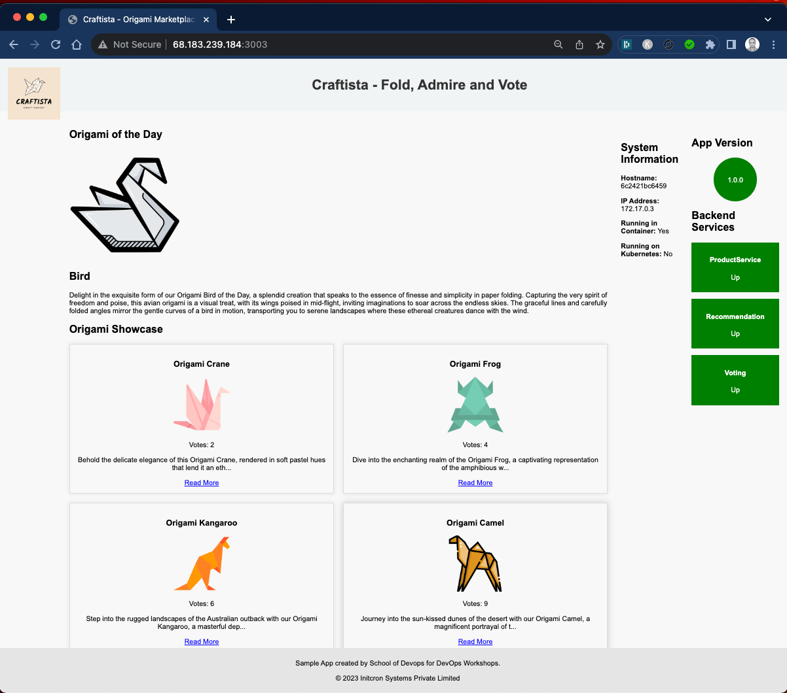
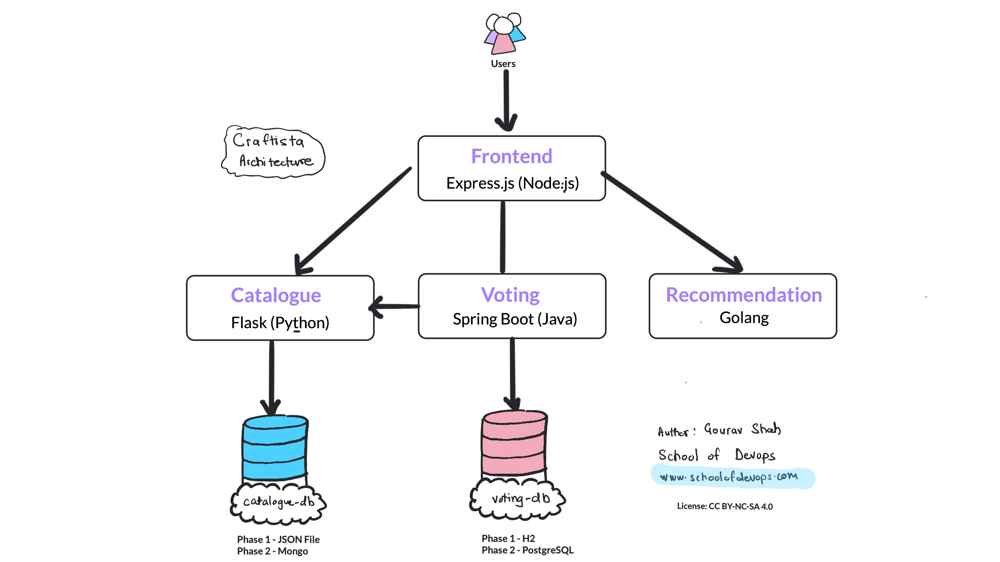

# Craftista Application (Microservices)

This repository contains the **Application Source Code** and **Helm Charts** for the Craftista microservices platform.

> [!NOTE]
> **Infrastructure Repository**: The Terraform code to provision the EKS cluster for this application is available at [AWS-EKS-Infrastructure](https://github.com/Abhin-Anilkumar/EKS-project-for-8byte).

## Documentation

For detailed technical insights, please refer to:
- **[APPROACH.md](APPROACH.md)**: Design rationale, networking strategy, and architectural decisions.
- **[CHALLENGES.md](CHALLENGES.md)**: A log of hurdles encountered (Architecture mismatches, connectivity hangs) and their resolutions.
- **[DASHBOARD.md](DASHBOARD.md)**: Monitoring and observability strategy.


## What is Craftista: Celebrating the Art of Origami 

Welcome to Craftista, a unique web platform dedicated to the beautiful and intricate world of origami. Craftista is a place where origami enthusiasts and artists come together to showcase their creations, share their passion, and engage with a like-minded community. Our platform allows users to explore a diverse range of origami art, vote for their favorites, and get inspired by the daily featured origami.



### Features

**Origami Showcase**: 

Discover a wide array of origami creations, ranging from traditional designs to contemporary art pieces. Each origami has its own story and charm, waiting to be unfolded.

**User Voting System**: 

Participate in the community by voting for your favorite origami pieces. See what creations are trending and show your support for the artists.
Daily Origami Recommendation: Be greeted daily with a new origami masterpiece, handpicked to inspire and ignite your passion for paper folding.

**Origami of the Day**: 

Learn more about origami artists, their work, and their journey into the world of paper art.

---


## The Architecture 

Craftista is not just an origami platform; it's a demonstration of modern web application development and microservices architecture. It leverages multiple backend services, including:



### Micro Service 01 - Frontend
- **Language**: Node.js  
- **Framework**: Express.js  

### Micro Service 02 - Catalogue
- **Language**: Python  
- **Framework**: Flask  

###  Micro Service 03 - Voting
- **Language**: Java
- **Framework**: Spring Boot   

###  Micro Service 04 - Recommendation 
- **Language**: Golang  

---

## Repository Structure (Best Practices)

The repository follows a clean monorepo structure with centralized Helm charts:

```text
.
├── charts/                 # Centralized Helm Charts
│   ├── catalogue/          # Catalogue service chart
│   ├── frontend/           # Frontend service chart
│   ├── recommendation/     # Recommendation service chart
│   └── voting/             # Voting service chart
├── catalogue/              # Python Catalogue service source
├── frontend/               # Node.js Frontend service source
├── recommendation/         # Go Recommendation service source
├── voting/                 # Java Voting service source
├── docs/                   # Architecture diagrams and assets
├── .github/workflows/      # GitHub Actions CI/CD pipelines
└── README.md               # Main project documentation
```

---

## CI/CD Pipeline

The project implements a streamlined CI/CD pipeline using **GitHub Actions**:

### 1. Build and Push
- Automated Docker builds for all microservices (Frontend, Catalogue, Voting, Recommendation).
- Multi-architecture support (`linux/amd64`) for EKS compatibility.
- Seamless authentication and push to **Amazon ECR**.

### 2. Automated Deployment
- Automated deployment to the **Amazon EKS** production cluster using Helm.
- Success/Failure email notifications for build and deployment status.

---

## Security Considerations

- **Network Isolation**: EKS worker nodes and RDS instances are hosted in **private subnets**.
- **IAM (IRSA)**: Least-privilege access for the AWS Load Balancer Controller.
- **Node Security**: Unified node group ensures a consistent security posture.

## Cost Optimization

- **Right-Sizing**: Using `t3.medium` instances for optimal resource usage.
- **Storage Management**: RDS auto-scaling is managed via `max_allocated_storage`.

---
*Note: The Application Load Balancer is configured and ready to provision once account-level ELB creation restrictions are lifted.*
